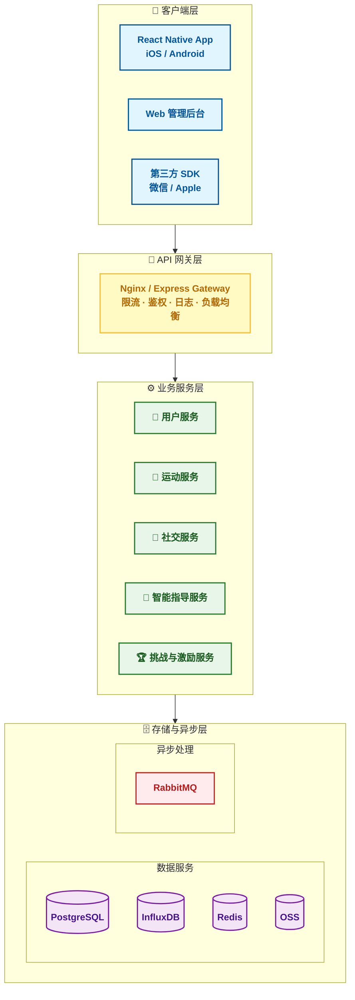

# Moveup 系统架构设计文档

## 1. 文档概述

本文档描述 Moveup 运动跑步软件的整体系统架构，包括各层职责、技术选型、组件交互及关键设计决策。架构遵循分层与模块化原则，保障系统的高可用、可扩展与可维护性。

## 2. 架构总览

Moveup 采用典型的分层架构，从外至内分为客户端层、API网关层、业务服务层、存储与异步层，各层职责明确，依赖关系清晰。

### 2.1 架构图

## 3. 各层职责与技术选型

### 3.1 客户端层

- **功能**：提供用户交互界面，集成第三方登录 SDK，收集运动数据并展示。
- **组件**：
  - `AndroidStudio`：跨平台移动端应用，支持Android平台，负责运动追踪、社交、个人中心等核心功能。
- **技术选型**：android原生开发框架、TypeScript、Axios、高德/谷歌地图 SDK。

### 3.2 API 网关层

- **功能**：统一入口，处理跨切面关注点（鉴权、限流、日志、负载均衡），将请求路由至后端服务。
- **组件**：
  - `Nginx / Express Gateway`：反向代理，配置路由规则，集成 JWT 认证中间件，实现 API 限流。
- **技术选型**：Nginx（高性能反向代理）或 Express Gateway（基于 Node.js 的 API 网关）。

### 3.3 业务服务层

采用模块化单体（初期）或微服务架构，按业务域拆分服务，降低耦合，便于独立迭代。

| 服务名称 | 职责 | 主要技术 |
|----------|------|----------|
| 用户服务 | 注册/登录、个人资料管理、设备管理、账号安全 | Node.js + Express，JWT |
| 运动服务 | 实时运动追踪、运动记录管理、路线管理 | WebSocket，GPS 纠偏算法 |
| 社交服务 | 好友系统、社区动态、点赞评论、排行榜 | Node.js，WebSocket 推送 |
| 智能指导服务 | AI 训练计划、语音指导、健康建议 | 规则引擎 / 机器学习 |
| 挑战与激励服务 | 任务系统、成就徽章、实景挑战、会员积分 | 定时任务，Redis 计数 |

### 3.4 存储与异步层

- **数据服务**：
  - **PostgreSQL**：存储结构化数据（用户、运动记录元数据、社交关系、任务/成就），支持 JSONB 和空间查询（PostGIS）。
  - **InfluxDB**：时序数据库，存储 GPS 点序列、心率流、分段配速等高频率写入数据，便于高效查询与聚合。
  - **Redis**：缓存热点数据（会话、排行榜、热门路线），同时作为消息队列（Pub/Sub）或计数器。
  - **OSS (对象存储)**：存储用户头像、运动截图、社区图片，提供 CDN 加速。
- **异步处理**：
  - **RabbitMQ**：处理耗时任务，如运动数据后处理（分段配速、卡路里计算）、图片压缩、消息推送等，削峰填谷，提高系统响应速度。

## 4. 关键交互流程

### 4.1 用户登录流程

1. 移动端 App 调用第三方 SDK 获取授权码（微信/Apple），或直接输入手机号+验证码。
2. 请求经网关层鉴权（白名单），转发至用户服务。
3. 用户服务校验凭证，若为新用户则创建账户，生成 JWT 并返回。
4. 客户端携带 JWT 访问后续接口。

### 4.2 运动实时追踪流程

1. 用户开始跑步，App 通过 WebSocket 与运动服务建立长连接。
2. App 每秒上报 GPS 点、心率数据（JSON 格式）。
3. 运动服务实时计算配速、距离，并将轨迹点写入 InfluxDB，同时通过 WebSocket 推送语音提醒指令。
4. 运动结束后，客户端调用 HTTP API 提交完整轨迹（压缩后）至运动服务。
5. 运动服务将记录元数据存入 PostgreSQL，并将轨迹文件上传至 OSS，同时通过 RabbitMQ 触发后处理任务（生成分段数据、统计周/月报表）。

### 4.3 社交动态发布流程

1. 用户撰写动态，可选择关联某次运动记录。
2. 请求经网关认证后，转发至社交服务。
3. 社交服务将动态写入 PostgreSQL，若包含图片则上传至 OSS。
4. 社交服务通过 WebSocket 向好友推送新动态通知。
5. 异步任务（通过 RabbitMQ）更新用户活跃度、生成动态 feed。

## 5. 安全与性能设计

### 5.1 安全策略

- **传输安全**：全站 HTTPS，敏感字段（密码）使用 bcrypt 哈希存储。
- **认证授权**：JWT 无状态认证，支持黑名单（Redis 存储已注销 token）。
- **防攻击**：API 网关层限流（每 IP 每分钟 100 次），SQL 注入过滤（参数化查询），XSS 过滤输出内容。
- **数据备份**：PostgreSQL 每日全量备份，WAL 归档保留 7 天。

### 5.2 性能指标

- **并发支持**：单业务服务节点可支撑 1000+ QPS（读写混合）。
- **响应时间**：95% 接口响应时间 < 200ms（网关层+业务层）。
- **可用性**：服务可用性 99.9%，数据库主从切换 < 60 秒。

### 5.3 扩展性设计

- **水平扩展**：业务服务无状态，可通过负载均衡横向扩容；PostgreSQL 采用主从复制，读扩展；InfluxDB 支持集群（企业版）。
- **消息队列**：异步解耦，避免因耗时任务拖垮主流程。
- **模块化**：各服务独立部署，可逐步演进为微服务，降低单体爆炸风险。

## 6. 部署架构

- **容器化**：所有服务（网关、业务服务、Redis、PostgreSQL 等）使用 Docker 打包，通过 Docker Compose 编排。
- **生产环境**：部署在云服务器（如阿里云 ECS），使用云数据库 RDS for PostgreSQL 和云 Redis 托管服务，减轻运维负担。
- **CDN**：静态资源（头像、图片）通过 OSS + CDN 加速。

## 7. 技术选型总结

| 层级 | 技术栈 |
|------|--------|
| 客户端 | Android原生开发、高德/谷歌地图 SDK |
| 后端框架 | Node.js + Express + TypeScript |
| 数据库 | PostgreSQL (主) + InfluxDB (时序) + Redis (缓存) |
| 存储 | 阿里云 OSS / MinIO |
| 消息队列 | RabbitMQ |
| 网关 | Nginx / Express Gateway |
| 部署 | Docker + Docker Compose，云服务器 |

## 8. 演进路线

- **阶段一（MVP）**：采用模块化单体，所有服务在一个进程中，简化部署，快速验证业务。
- **阶段二（成熟期）**：根据负载将热点服务（如运动服务）拆分为独立微服务，引入 API 网关统一治理。
- **阶段三（规模化）**：引入服务网格（如 Istio），实现灰度发布、熔断降级，全面云原生。

---

*文档版本：v1.0*  
*最后更新：2026-03-25*  
*维护者：蔡燚翔*

