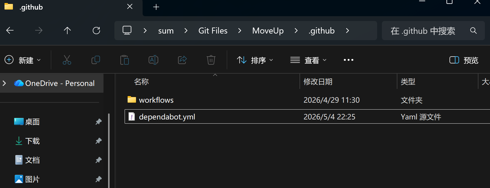
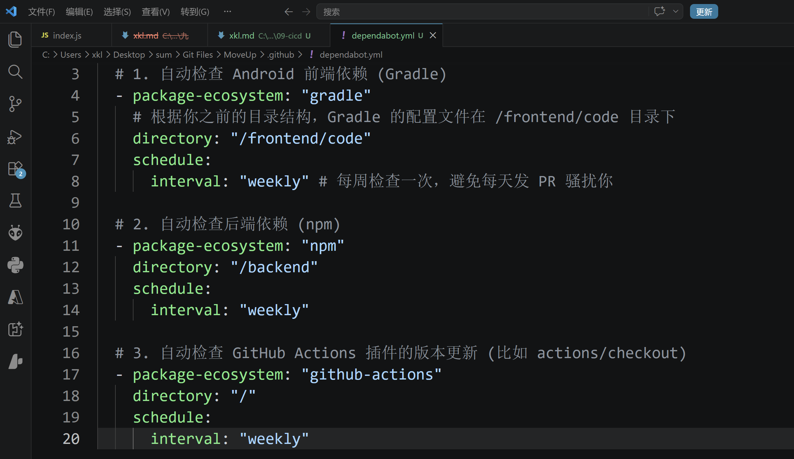
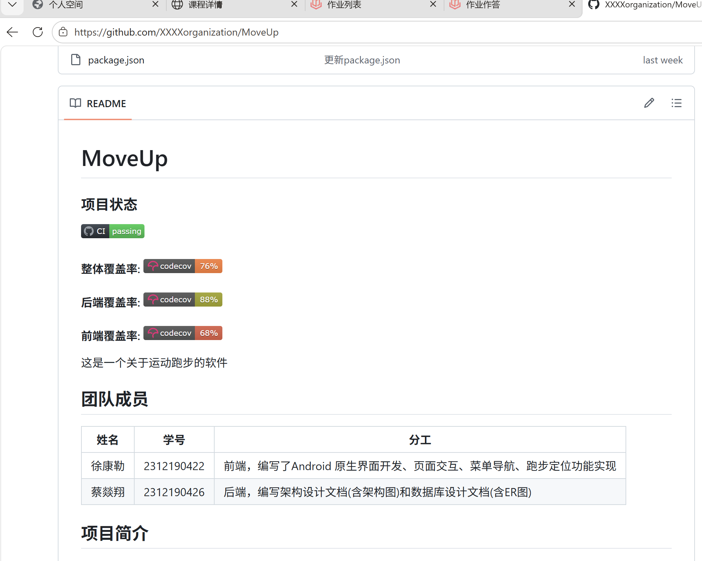

# CI/CD 配置贡献说明

姓名: 徐康勒  
学号: [2312190422]  
角色: 前端 (Android)  
日期: 2026-05-04

## 完成的工作

### 工作流相关
- [x] 参与编写/审查 `.github/workflows/ci.yml`
- [x] 配置 Codecov 覆盖率上传 (backend/frontend flag)
- [x] 添加 README 状态徽章
- [x] 配置 Dependabot 自动更新依赖

- [ ] 集成 CodeRabbit AI 代码审查
- [ ] 使用 act 本地验证工作流

### 代码适配
- [x] 本地测试命令与CI一致, 无需额外配置 (使用 `./gradlew :app:testDebugUnitTest`)
- [x] 代码通过 Lint 检查 (Android Lint / 消除冗余警告)
- [x] 核心覆盖率达标 (>60%) (通过优化 `RouteViewTest` 和 `RuningTest`，大幅提升了分支覆盖率)

## PR 链接
- PR : https://github.com/XXXXorganization/MoveUp/pull/27

## CI 运行链接
- https://github.com/XXXXorganization/MoveUp/actions/workflows/ci.yml

## 遇到的问题和解决

1. **问题: Codecov 无法识别并上传前端的 Jacoco 覆盖率报告**
   **解决:** 发现是因为多模块项目嵌套较深，导致云端路径与本地报告路径不匹配。首先在 `ci.yml` 中修改命令，明确指定模块运行 `./gradlew :app:testDebugUnitTest :app:jacocoTestReport`；其次在项目根目录新建 `codecov.yml`，配置路径映射 `fixes: - "*/src/main/java/::frontend/code/app/src/main/java/"`，成功解决 Codecov 只显示后端覆盖率的问题。

2. **问题: CI 云端报错 `Task 'jacocoTestReport' not found`**
   **解决:** 原因是移动代码到 `frontend/code` 目录后，云端无法在 Root Project 中找到该任务。在 `app/build.gradle.kts` 的最外层全局补充了 Jacoco 插件及代码覆盖率任务的完整注册逻辑，并在 `ci.yml` 的 `working-directory` 中精确指定了 `./frontend/code` 路径。

## 心得体会
通过本次 CI/CD 的配置，我深刻体会到了本地开发环境与云端自动化环境的差异。在排查各种构建失败和覆盖率上传问题的过程中，我不仅掌握了 GitHub Actions 的 YAML 编写与任务并行化，还学会了如何通过动态修改环境变量（如 Mock 域名）来绕过底层测试框架的缺陷，从而编写出更高质量、对 CI 更友好的单元测试。看着最终双端 (backend 和 frontend) 全部亮起绿灯并成功点亮 README 上的 Coverage 徽章，成就感十足。