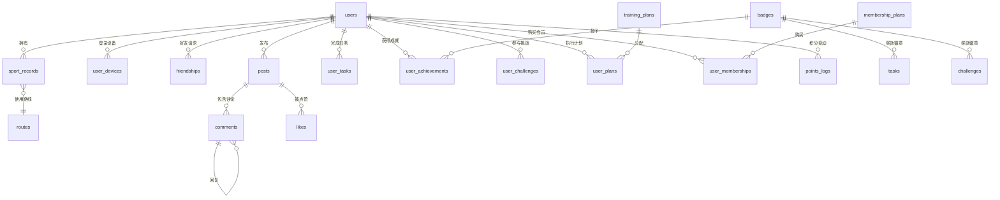

# Moveup 数据库设计文档

## 1. 文档概述

本文档描述 Moveup 运动跑步软件的数据库结构设计，涵盖用户管理、运动数据、社交互动、挑战激励、智能指导、会员服务等核心模块。数据库采用 **PostgreSQL** 作为关系型存储，利用其 JSONB、UUID 等特性满足灵活扩展需求；同时结合 **InfluxDB** 存储时序数据（如 GPS 点序列、心率流），本文档聚焦于 PostgreSQL 部分的结构设计。

## 2. ER 图总览

系统共包含 19 张核心表，其关系如下（使用 Mermaid 绘制）：

## 3. 模块划分与表结构

### 3.1 用户管理模块

#### 3.1.1 用户表 `users`

存储用户账号信息、个人资料及运动偏好。

| 字段 | 类型 | 约束 | 描述 |
|------|------|------|------|
| id | UUID | PK, default: `gen_random_uuid()` | 用户唯一标识 |
| phone | VARCHAR(20) | UNIQUE, NOT NULL | 手机号（登录凭证） |
| nickname | VARCHAR(50) | NOT NULL | 昵称 |
| avatar | VARCHAR(255) | | 头像 URL |
| gender | SMALLINT | | 性别：0-未知，1-男，2-女 |
| birthday | DATE | | 生日 |
| height | SMALLINT | | 身高（cm） |
| weight | DECIMAL(5,2) | | 体重（kg） |
| target_distance | INT | | 目标距离（米） |
| target_time | INT | | 目标时间（分钟） |
| role | VARCHAR(20) | DEFAULT 'user' | 角色：user / admin |
| created_at | TIMESTAMPTZ | DEFAULT now() | 创建时间 |
| updated_at | TIMESTAMPTZ | DEFAULT now() | 更新时间（自动更新） |

**索引**：
- `phone`：用于手机号快速登录。

#### 3.1.2 用户设备表 `user_devices`

记录用户登录过的设备，用于设备管理和安全提醒。

| 字段 | 类型 | 约束 | 描述 |
|------|------|------|------|
| id | UUID | PK | 设备记录唯一标识 |
| user_id | UUID | FK → users.id | 所属用户 |
| device_type | VARCHAR(20) | | 设备类型：ios / android / web |
| device_token | VARCHAR(255) | | 推送 Token |
| login_time | TIMESTAMPTZ | DEFAULT now() | 登录时间 |
| logout_time | TIMESTAMPTZ | | 登出时间 |
| is_active | BOOLEAN | DEFAULT true | 是否当前活跃设备 |

**索引**：
- `user_id`：快速查询用户的所有设备。

### 3.2 运动数据模块

#### 3.2.1 运动记录表 `sport_records`

存储每次运动的详细数据，包括轨迹（JSONB）、心率、配速等。

| 字段 | 类型 | 约束 | 描述 |
|------|------|------|------|
| id | UUID | PK | 运动记录唯一标识 |
| user_id | UUID | FK → users.id | 所属用户 |
| start_time | TIMESTAMPTZ | NOT NULL | 运动开始时间 |
| end_time | TIMESTAMPTZ | NOT NULL | 运动结束时间 |
| distance | INT | NOT NULL | 距离（米） |
| duration | INT | NOT NULL | 时长（秒） |
| calories | INT | | 消耗卡路里（千卡） |
| avg_pace | DECIMAL(5,2) | | 平均配速（秒/公里） |
| max_pace | DECIMAL(5,2) | | 最大配速（秒/公里） |
| avg_heart_rate | SMALLINT | | 平均心率 |
| max_heart_rate | SMALLINT | | 最大心率 |
| gps_track | JSONB | | 轨迹点数组，如 `[{lat, lng, timestamp, heart_rate?}]` |
| route_id | UUID | FK → routes.id | 关联的路线（可选） |
| created_at | TIMESTAMPTZ | DEFAULT now() | 记录创建时间 |

**索引**：
- `user_id`：查询用户历史记录。
- `start_time`：按时间范围筛选。

#### 3.2.2 路线表 `routes`

存储用户保存的常用路线或系统推荐的热门路线。

| 字段 | 类型 | 约束 | 描述 |
|------|------|------|------|
| id | UUID | PK | 路线唯一标识 |
| name | VARCHAR(100) | NOT NULL | 路线名称 |
| start_point | JSONB | | 起点信息，如 `{lat, lng, address}` |
| end_point | JSONB | | 终点信息 |
| distance | INT | | 距离（米） |
| elevation_gain | INT | | 累计爬升（米） |
| popularity | INT | DEFAULT 0 | 热度（被使用次数） |
| is_hot | BOOLEAN | DEFAULT false | 是否热门路线 |
| created_by | UUID | FK → users.id | 创建者（用户保存的路线） |
| created_at | TIMESTAMPTZ | DEFAULT now() | 创建时间 |

**索引**：
- `popularity`：热门排序。
- `is_hot`：快速筛选热门路线。

### 3.3 社交互动模块

#### 3.3.1 好友关系表 `friendships`

记录用户之间的好友关系。

| 字段 | 类型 | 约束 | 描述 |
|------|------|------|------|
| user_id | UUID | PK, FK → users.id | 用户 A |
| friend_id | UUID | PK, FK → users.id | 用户 B |
| status | SMALLINT | DEFAULT 0 | 状态：0-待确认，1-已确认，2-已拒绝 |
| created_at | TIMESTAMPTZ | DEFAULT now() | 请求发送时间 |
| updated_at | TIMESTAMPTZ | DEFAULT now() | 状态更新时间 |

**联合主键**：`(user_id, friend_id)` 确保唯一关系。

#### 3.3.2 动态表 `posts`

用户发布的动态内容，可关联运动记录。

| 字段 | 类型 | 约束 | 描述 |
|------|------|------|------|
| id | UUID | PK | 动态唯一标识 |
| user_id | UUID | FK → users.id | 发布者 |
| content | TEXT | | 文字内容 |
| images | JSONB | | 图片 URL 数组 |
| sport_record_id | UUID | FK → sport_records.id | 关联的运动记录（可选） |
| location | VARCHAR(255) | | 位置信息 |
| tags | JSONB | | 话题标签数组，如 `["#晨跑","#马拉松"]` |
| like_count | INT | DEFAULT 0 | 点赞数（冗余，提升查询性能） |
| comment_count | INT | DEFAULT 0 | 评论数（冗余） |
| created_at | TIMESTAMPTZ | DEFAULT now() | 发布时间 |

**索引**：
- `user_id`：查询用户动态列表。
- `created_at`：按时间排序。

#### 3.3.3 点赞表 `likes`

记录用户对动态或评论的点赞行为。

| 字段 | 类型 | 约束 | 描述 |
|------|------|------|------|
| id | UUID | PK | 点赞唯一标识 |
| user_id | UUID | FK → users.id | 点赞用户 |
| target_type | VARCHAR(20) | NOT NULL | 目标类型：post / comment |
| target_id | UUID | NOT NULL | 目标 ID |
| created_at | TIMESTAMPTZ | DEFAULT now() | 点赞时间 |

**唯一约束**：`(user_id, target_type, target_id)` 防止重复点赞。  
**索引**：`(target_type, target_id)` 用于统计某目标点赞数。

#### 3.3.4 评论表 `comments`

支持多级回复的评论系统。

| 字段 | 类型 | 约束 | 描述 |
|------|------|------|------|
| id | UUID | PK | 评论唯一标识 |
| user_id | UUID | FK → users.id | 评论者 |
| post_id | UUID | FK → posts.id | 所属动态 |
| parent_id | UUID | FK → comments.id | 父评论 ID（回复评论时使用） |
| content | TEXT | NOT NULL | 评论内容 |
| like_count | INT | DEFAULT 0 | 点赞数（冗余） |
| created_at | TIMESTAMPTZ | DEFAULT now() | 评论时间 |

**索引**：
- `post_id`：查询某动态的所有评论。
- `created_at`：评论排序。

### 3.4 挑战与激励模块

#### 3.4.1 徽章表 `badges`

定义系统所有成就徽章。

| 字段 | 类型 | 约束 | 描述 |
|------|------|------|------|
| id | UUID | PK | 徽章唯一标识 |
| name | VARCHAR(50) | NOT NULL | 徽章名称 |
| description | TEXT | | 描述 |
| icon | VARCHAR(255) | | 图标 URL |
| condition_type | VARCHAR(30) | | 达成条件类型：distance_total / marathon_completed / streak_days 等 |
| condition_value | INT | | 达成所需数值 |
| rarity | VARCHAR(20) | | 稀有度：common / rare / epic / legendary |
| created_at | TIMESTAMPTZ | DEFAULT now() | 创建时间 |

#### 3.4.2 任务表 `tasks`

定义日常、周常或成就类任务。

| 字段 | 类型 | 约束 | 描述 |
|------|------|------|------|
| id | UUID | PK | 任务唯一标识 |
| name | VARCHAR(100) | NOT NULL | 任务名称 |
| description | TEXT | | 任务描述 |
| task_type | VARCHAR(30) | | 类型：daily / weekly / achievement |
| requirement | JSONB | | 要求，如 `{target: 5, unit: 'km'}` |
| reward_points | INT | DEFAULT 0 | 奖励积分 |
| reward_badge_id | UUID | FK → badges.id | 奖励徽章（可选） |
| is_active | BOOLEAN | DEFAULT true | 是否启用 |
| created_at | TIMESTAMPTZ | DEFAULT now() | 创建时间 |

#### 3.4.3 用户任务完成表 `user_tasks`

记录用户对任务的完成进度。

| 字段 | 类型 | 约束 | 描述 |
|------|------|------|------|
| id | UUID | PK | 记录唯一标识 |
| user_id | UUID | FK → users.id | 用户 |
| task_id | UUID | FK → tasks.id | 任务 |
| progress | INT | DEFAULT 0 | 当前进度 |
| is_completed | BOOLEAN | DEFAULT false | 是否完成 |
| completed_at | TIMESTAMPTZ | | 完成时间 |
| created_at | TIMESTAMPTZ | DEFAULT now() | 创建时间 |

**唯一约束**：`(user_id, task_id)` 防止重复记录。  
**索引**：`user_id` 快速查询用户任务。

#### 3.4.4 用户成就表 `user_achievements`

记录用户已获得的徽章。

| 字段 | 类型 | 约束 | 描述 |
|------|------|------|------|
| id | UUID | PK | 记录唯一标识 |
| user_id | UUID | FK → users.id | 用户 |
| badge_id | UUID | FK → badges.id | 徽章 |
| achieved_at | TIMESTAMPTZ | DEFAULT now() | 获得时间 |

**唯一约束**：`(user_id, badge_id)` 防止重复获得。  
**索引**：`user_id`。

#### 3.4.5 挑战赛表 `challenges`

定义限时挑战活动。

| 字段 | 类型 | 约束 | 描述 |
|------|------|------|------|
| id | UUID | PK | 挑战唯一标识 |
| name | VARCHAR(100) | NOT NULL | 挑战名称 |
| description | TEXT | | 描述 |
| challenge_type | VARCHAR(30) | | 类型：virtual_route / team_relay / distance |
| start_time | TIMESTAMPTZ | NOT NULL | 开始时间 |
| end_time | TIMESTAMPTZ | NOT NULL | 结束时间 |
| target_value | INT | | 目标值（如距离、次数） |
| reward_points | INT | | 奖励积分 |
| reward_badge_id | UUID | FK → badges.id | 奖励徽章 |
| created_at | TIMESTAMPTZ | DEFAULT now() | 创建时间 |

#### 3.4.6 用户参与挑战表 `user_challenges`

记录用户参与挑战的进度。

| 字段 | 类型 | 约束 | 描述 |
|------|------|------|------|
| id | UUID | PK | 记录唯一标识 |
| user_id | UUID | FK → users.id | 用户 |
| challenge_id | UUID | FK → challenges.id | 挑战 |
| progress | INT | DEFAULT 0 | 当前进度 |
| rank | INT | | 排名（可选） |
| is_completed | BOOLEAN | DEFAULT false | 是否完成 |
| joined_at | TIMESTAMPTZ | DEFAULT now() | 参与时间 |
| completed_at | TIMESTAMPTZ | | 完成时间 |

**唯一约束**：`(user_id, challenge_id)`。  
**索引**：`challenge_id` 用于统计挑战参与情况。

### 3.5 智能指导模块

#### 3.5.1 训练计划表 `training_plans`

系统预设的训练方案。

| 字段 | 类型 | 约束 | 描述 |
|------|------|------|------|
| id | UUID | PK | 计划唯一标识 |
| name | VARCHAR(100) | NOT NULL | 计划名称 |
| description | TEXT | | 描述 |
| difficulty | VARCHAR(20) | | 难度：beginner / intermediate / advanced |
| duration_weeks | INT | | 持续周数 |
| target_distance | INT | | 目标距离（米） |
| schedule | JSONB | | 详细日程，如 `[{week:1, days:[...]}]` |
| created_at | TIMESTAMPTZ | DEFAULT now() | 创建时间 |

#### 3.5.2 用户训练计划表 `user_plans`

记录用户当前执行的训练计划及进度。

| 字段 | 类型 | 约束 | 描述 |
|------|------|------|------|
| id | UUID | PK | 记录唯一标识 |
| user_id | UUID | FK → users.id | 用户 |
| plan_id | UUID | FK → training_plans.id | 计划 |
| current_week | INT | DEFAULT 1 | 当前周数 |
| current_day | INT | DEFAULT 1 | 当前天数 |
| is_active | BOOLEAN | DEFAULT true | 是否活跃 |
| started_at | TIMESTAMPTZ | DEFAULT now() | 开始时间 |
| completed_at | TIMESTAMPTZ | | 完成时间 |

**索引**：`user_id`。

### 3.6 会员服务模块

#### 3.6.1 会员套餐表 `membership_plans`

定义付费会员套餐。

| 字段 | 类型 | 约束 | 描述 |
|------|------|------|------|
| id | UUID | PK | 套餐唯一标识 |
| name | VARCHAR(50) | NOT NULL | 套餐名称 |
| duration_days | INT | | 有效天数 |
| price | DECIMAL(10,2) | | 价格（元） |
| features | JSONB | | 权益列表，如 `["专属计划","高级数据"]` |
| is_active | BOOLEAN | DEFAULT true | 是否在售 |
| created_at | TIMESTAMPTZ | DEFAULT now() | 创建时间 |

#### 3.6.2 用户会员记录表 `user_memberships`

记录用户购买会员的记录。

| 字段 | 类型 | 约束 | 描述 |
|------|------|------|------|
| id | UUID | PK | 记录唯一标识 |
| user_id | UUID | FK → users.id | 用户 |
| plan_id | UUID | FK → membership_plans.id | 购买的套餐 |
| start_date | TIMESTAMPTZ | NOT NULL | 开始时间 |
| end_date | TIMESTAMPTZ | NOT NULL | 到期时间 |
| is_active | BOOLEAN | DEFAULT true | 是否有效 |
| created_at | TIMESTAMPTZ | DEFAULT now() | 创建时间 |

**索引**：
- `user_id`：查询用户会员状态。
- `end_date`：用于定时任务清理过期会员。

#### 3.6.3 积分记录表 `points_logs`

记录用户积分的增减明细。

| 字段 | 类型 | 约束 | 描述 |
|------|------|------|------|
| id | UUID | PK | 记录唯一标识 |
| user_id | UUID | FK → users.id | 用户 |
| points_change | INT | NOT NULL | 积分变化值（正为增加，负为消耗） |
| source_type | VARCHAR(30) | | 来源类型：task / challenge / daily_checkin |
| source_id | UUID | | 来源 ID（如任务 ID） |
| description | VARCHAR(255) | | 描述 |
| created_at | TIMESTAMPTZ | DEFAULT now() | 发生时间 |

**索引**：`user_id` 和 `created_at` 用于积分流水查询。

## 4. 关键设计说明

### 4.1 数据类型选择
- **UUID 主键**：避免序列 ID 暴露业务量，适合分布式系统。
- **TIMESTAMPTZ**：带时区的时间戳，确保全球化部署时间准确。
- **JSONB**：存储非结构化数据（轨迹点、标签、配置），支持高效查询和部分更新。

### 4.2 索引策略
- 为外键字段建立索引（`user_id`, `post_id` 等），加速关联查询。
- 为排序字段建立索引（`created_at`, `start_time`）。
- 组合唯一约束用于关系表（如 `friendships`, `likes`）。

### 4.3 冗余设计
- `posts` 表中的 `like_count` 和 `comment_count` 为冗余字段，用于减少联表计数，提升列表加载性能。
- 这些字段通过触发器或应用层维护，确保数据一致性。

### 4.4 数据一致性
- 外键使用 `ON DELETE CASCADE` 或 `RESTRICT` 根据业务选择（如删除用户时自动删除其运动记录）。
- 使用触发器自动更新 `users.updated_at`。

## 5. 扩展与迁移

- **时序数据扩展**：GPS 点序列、心率流建议使用 **InfluxDB** 存储，与 PostgreSQL 互补，减轻关系库压力。
- **分表策略**：当 `points_logs` 数据量极大时，可考虑按时间分区。
- **迁移工具**：使用 **Knex.js** 管理所有结构变更，确保团队环境一致。

## 6. 附录：生成建表 SQL

完整建表 SQL 可通过 [dbdiagram.io](https://dbdiagram.io/d/69c23dbb78c6c4bc7a5191bf) 导出，或参考项目中的 `migrations/` 目录。
dbdiagram.io网址 https://dbdiagram.io/d/69c23dbb78c6c4bc7a5191bf

dbdiagram.io语法设计的ER图，复制以下代码即可，生成ER图
// ===========================================
// 1. 用户管理模块
// ===========================================
Table users {
  id UUID [pk, default: `gen_random_uuid()`]
  phone VARCHAR(20) [unique, not null]
  nickname VARCHAR(50) [not null]
  avatar VARCHAR(255)
  gender SMALLINT
  birthday DATE
  height SMALLINT
  weight DECIMAL(5,2)
  target_distance INT
  target_time INT
  role VARCHAR(20) [default: 'user']
  created_at TIMESTAMPTZ [default: `now()`]
  updated_at TIMESTAMPTZ [default: `now()`]
  indexes {
    phone
  }
}

Table user_devices {
  id UUID [pk, default: `gen_random_uuid()`]
  user_id UUID [ref: > users.id]
  device_type VARCHAR(20)
  device_token VARCHAR(255)
  login_time TIMESTAMPTZ [default: `now()`]
  logout_time TIMESTAMPTZ
  is_active BOOLEAN [default: true]
  indexes {
    user_id
  }
}

// ===========================================
// 2. 运动数据模块
// ===========================================
Table sport_records {
  id UUID [pk, default: `gen_random_uuid()`]
  user_id UUID [ref: > users.id]
  start_time TIMESTAMPTZ [not null]
  end_time TIMESTAMPTZ [not null]
  distance INT [not null]
  duration INT [not null]
  calories INT
  avg_pace DECIMAL(5,2)
  max_pace DECIMAL(5,2)
  avg_heart_rate SMALLINT
  max_heart_rate SMALLINT
  gps_track JSONB
  route_id UUID [ref: > routes.id]
  created_at TIMESTAMPTZ [default: `now()`]
  indexes {
    user_id
    start_time
  }
}

Table routes {
  id UUID [pk, default: `gen_random_uuid()`]
  name VARCHAR(100) [not null]
  start_point JSONB
  end_point JSONB
  distance INT
  elevation_gain INT
  popularity INT [default: 0]
  is_hot BOOLEAN [default: false]
  created_by UUID [ref: > users.id]
  created_at TIMESTAMPTZ [default: `now()`]
  indexes {
    popularity
    is_hot
  }
}

// ===========================================
// 3. 社交互动模块
// ===========================================
Table friendships {
  user_id UUID [ref: > users.id]
  friend_id UUID [ref: > users.id]
  status SMALLINT [default: 0]
  created_at TIMESTAMPTZ [default: `now()`]
  updated_at TIMESTAMPTZ [default: `now()`]
  primary key (user_id, friend_id)
}

Table posts {
  id UUID [pk, default: `gen_random_uuid()`]
  user_id UUID [ref: > users.id]
  content TEXT
  images JSONB
  sport_record_id UUID [ref: > sport_records.id]
  location VARCHAR(255)
  tags JSONB
  like_count INT [default: 0]
  comment_count INT [default: 0]
  created_at TIMESTAMPTZ [default: `now()`]
  indexes {
    user_id
    created_at
  }
}

Table likes {
  id UUID [pk, default: `gen_random_uuid()`]
  user_id UUID [ref: > users.id]
  target_type VARCHAR(20)
  target_id UUID
  created_at TIMESTAMPTZ [default: `now()`]
  indexes {
    (user_id, target_type, target_id) [unique]
    (target_type, target_id)
  }
}

Table comments {
  id UUID [pk, default: `gen_random_uuid()`]
  user_id UUID [ref: > users.id]
  post_id UUID [ref: > posts.id]
  parent_id UUID [ref: > comments.id]
  content TEXT [not null]
  like_count INT [default: 0]
  created_at TIMESTAMPTZ [default: `now()`]
  indexes {
    post_id
    created_at
  }
}

// ===========================================
// 4. 挑战与激励模块
// ===========================================
Table badges {
  id UUID [pk, default: `gen_random_uuid()`]
  name VARCHAR(50) [not null]
  description TEXT
  icon VARCHAR(255)
  condition_type VARCHAR(30)
  condition_value INT
  rarity VARCHAR(20)
  created_at TIMESTAMPTZ [default: `now()`]
}

Table tasks {
  id UUID [pk, default: `gen_random_uuid()`]
  name VARCHAR(100) [not null]
  description TEXT
  task_type VARCHAR(30)
  requirement JSONB
  reward_points INT [default: 0]
  reward_badge_id UUID [ref: > badges.id]
  is_active BOOLEAN [default: true]
  created_at TIMESTAMPTZ [default: `now()`]
}

Table user_tasks {
  id UUID [pk, default: `gen_random_uuid()`]
  user_id UUID [ref: > users.id]
  task_id UUID [ref: > tasks.id]
  progress INT [default: 0]
  is_completed BOOLEAN [default: false]
  completed_at TIMESTAMPTZ
  created_at TIMESTAMPTZ [default: `now()`]
  indexes {
    (user_id, task_id) [unique]
    user_id
  }
}

Table user_achievements {
  id UUID [pk, default: `gen_random_uuid()`]
  user_id UUID [ref: > users.id]
  badge_id UUID [ref: > badges.id]
  achieved_at TIMESTAMPTZ [default: `now()`]
  indexes {
    (user_id, badge_id) [unique]
    user_id
  }
}

Table challenges {
  id UUID [pk, default: `gen_random_uuid()`]
  name VARCHAR(100) [not null]
  description TEXT
  challenge_type VARCHAR(30)
  start_time TIMESTAMPTZ [not null]
  end_time TIMESTAMPTZ [not null]
  target_value INT
  reward_points INT
  reward_badge_id UUID [ref: > badges.id]
  created_at TIMESTAMPTZ [default: `now()`]
}

Table user_challenges {
  id UUID [pk, default: `gen_random_uuid()`]
  user_id UUID [ref: > users.id]
  challenge_id UUID [ref: > challenges.id]
  progress INT [default: 0]
  rank INT
  is_completed BOOLEAN [default: false]
  joined_at TIMESTAMPTZ [default: `now()`]
  completed_at TIMESTAMPTZ
  indexes {
    (user_id, challenge_id) [unique]
    challenge_id
  }
}

// ===========================================
// 5. 智能指导模块
// ===========================================
Table training_plans {
  id UUID [pk, default: `gen_random_uuid()`]
  name VARCHAR(100) [not null]
  description TEXT
  difficulty VARCHAR(20)
  duration_weeks INT
  target_distance INT
  schedule JSONB
  created_at TIMESTAMPTZ [default: `now()`]
}

Table user_plans {
  id UUID [pk, default: `gen_random_uuid()`]
  user_id UUID [ref: > users.id]
  plan_id UUID [ref: > training_plans.id]
  current_week INT [default: 1]
  current_day INT [default: 1]
  is_active BOOLEAN [default: true]
  started_at TIMESTAMPTZ [default: `now()`]
  completed_at TIMESTAMPTZ
  indexes {
    user_id
  }
}

// ===========================================
// 6. 会员服务模块
// ===========================================
Table membership_plans {
  id UUID [pk, default: `gen_random_uuid()`]
  name VARCHAR(50) [not null]
  duration_days INT
  price DECIMAL(10,2)
  features JSONB
  is_active BOOLEAN [default: true]
  created_at TIMESTAMPTZ [default: `now()`]
}

Table user_memberships {
  id UUID [pk, default: `gen_random_uuid()`]
  user_id UUID [ref: > users.id]
  plan_id UUID [ref: > membership_plans.id]
  start_date TIMESTAMPTZ [not null]
  end_date TIMESTAMPTZ [not null]
  is_active BOOLEAN [default: true]
  created_at TIMESTAMPTZ [default: `now()`]
  indexes {
    user_id
    end_date
  }
}

Table points_logs {
  id UUID [pk, default: `gen_random_uuid()`]
  user_id UUID [ref: > users.id]
  points_change INT [not null]
  source_type VARCHAR(30)
  source_id UUID
  description VARCHAR(255)
  created_at TIMESTAMPTZ [default: `now()`]
  indexes {
    user_id
    created_at
  }
}