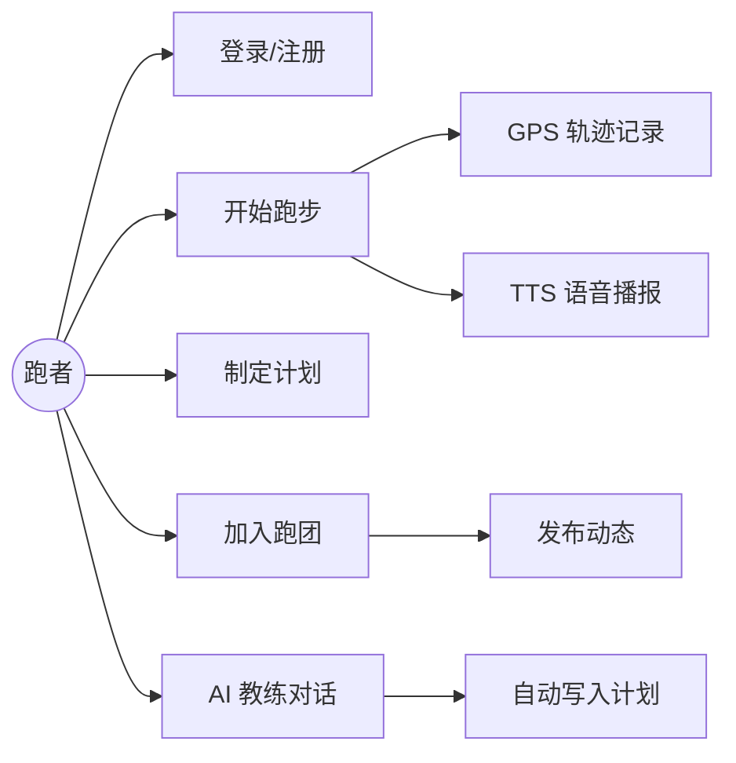
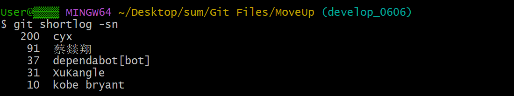
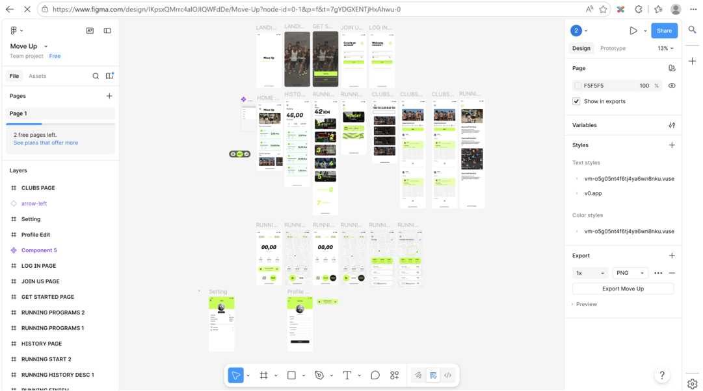
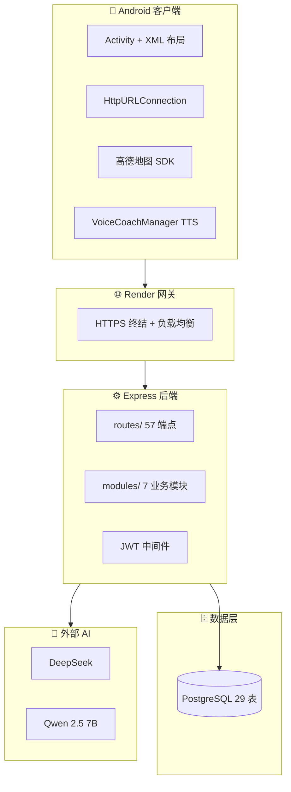

---

# 一、项目介绍 [徐康勒、蔡燚翔]

## 1.1 背景与问题陈述

随着全民健身意识提升，跑步已成为最普及的有氧运动之一。然而，初学者和进阶跑者普遍面临以下痛点：

- **缺乏科学指导**：不清楚如何制定训练计划、控制配速，容易受伤或半途而废。
- **运动数据分散**：轨迹、配速、心率等数据难以统一记录与回顾。
- **社交激励不足**：独自跑步缺乏同伴督促，难以坚持长期训练。
- **工具门槛高**：市面部分运动 App 功能臃肿、广告干扰，或需要复杂账号体系。

MoveUp 针对上述问题，提供一款**轻量、专注跑步场景**的 Android 原生应用，结合后端 REST API 与 AI 能力，帮助用户记录运动、制定计划、加入跑团、获得语音教练反馈，降低跑步入门门槛并提升坚持动力。

## 1.2 项目目标与核心功能

### 功能性需求（已实现）

| 模块 | 功能描述 |
|------|---------|
| 用户管理 | 手机号注册/登录、JWT 鉴权、个人资料编辑 |
| 实时运动追踪 | GPS 轨迹记录（高德地图 SDK）、配速/距离/卡路里实时计算、轨迹可视化 |
| AI 语音教练 | 跑步过程中 TTS 播报；AI 对话助手（Deepseek/通义千问）支持查询数据、自动排训练计划；可以根据当前的定位获取周围风景数据并进行讲述相关风景地点并指明方向 |
| 社团社交 | 跑团列表、加入/退出、发动态、点赞评论、分享跑步记录 |
| 训练计划 | 按周一至周日定制计划项、打勾标记完成、展示本周实际里程 |
| 历史记录 | 跑步历史列表、详情展示、关联社群活动 |
| 发现 | 搜索附近跑团、浏览社区内容 |

### 非功能性需求

| 类别 | 目标 | 实现情况 |
|------|------|---------|
| 性能 | 跑步页 GPS 更新流畅，API P95 响应 < 500ms | 已实现本地轨迹绘制 + 后端批量 GPS 上传 |
| 可用性 | 核心流程 3 步内可达（登录 → 开始跑步 → 查看记录） | 底部导航 + 侧边栏双入口设计 |
| 安全性 | JWT 鉴权、密码 bcrypt 哈希、参数化 SQL | 已实现，并通过安全审查 |
| 可维护性 | 模块化后端、CI 自动化测试 | 7 个业务模块 + GitHub Actions |
| 可部署性 | Docker 一键启动、云端可访问 | Docker Compose + Render 部署 |

### 用例概览



## 1.3 技术选型

| 层级 | 技术 | 选型理由 |
|------|------|---------|
| Android 前端 | Java + XML 布局 | 课程要求原生开发；团队熟悉 Java，可直接调用高德 SDK |
| 地图定位 | 高德地图 SDK | 国内定位精度高，Polyline 轨迹绘制成熟 |
| 网络层 | HttpURLConnection | 轻量无额外依赖，便于 Mock 测试 |
| 图片加载 | Glide | Android 社区标准图片库，支持 GIF |
| 后端 | Node.js 18 + Express + TypeScript | 异步 I/O 适合 API 服务；TS 提供类型安全 |
| 数据库 | PostgreSQL 15 | 关系型 + JSONB 存 GPS 轨迹与图片，无需独立 OSS |
| ORM/迁移 | Knex.js | 轻量查询构建器，迁移脚本版本化管理 |
| 认证 | JWT（Bearer Token，2h 有效期） | 无状态，适合移动端 |
| AI | DeepSeek（运动分析）+ 通义千问 Qwen 2.5 7B（对话） | 国内 API 可用，成本低 |
| 容器化 | Docker + Docker Compose | 环境一致，本地与生产对齐 |
| 云端部署 | Render（Web Service + 托管 PostgreSQL） | 免费套餐适合课程演示，自动 HTTPS |
| CI/CD | GitHub Actions + Codecov | push/PR 自动跑测试与覆盖率上报 |

## 1.4 团队分工

| 成员 | 学号 | 主要负责模块 |
|------|------|-------------|
| 徐康勒 | 2312190422 | Android 前端开发、UI/UX 设计（Figma）、AI 功能集成、Docker 前端分发页、前端单元测试、安全审查（前端）、可观测性（客户端） |
| 蔡燚翔 | 2312190426 | 后端架构与 API 实现、数据库设计与迁移、Docker 后端容器化、CI/CD（后端）、安全审查（后端）、Render 云端部署 |

---

# 二、版本控制与团队协作 [徐康勒、蔡燚翔]

## 2.1 分支策略

项目采用 **GitHub Flow** 简化分支模型：

| 分支 | 用途 | 保护规则 |
|------|------|---------|
| `main` | 生产就绪代码，对应 Render 部署 | PR 合并需 CI 通过 |
| `develop` | 集成开发分支 | CI 自动测试 |
| `feature/*` | 功能开发（如 `feature/club-api`） | 开发完成后提 PR |
| `dependabot/*` | Dependabot 自动依赖更新 | 经 CI 验证后合并 |

## 2.2 提交规范

- **Commit Message**：采用动词开头的中文/英文短描述，如 `添加创建社团API`、`修复重复createClub`。
- **PR 流程**：功能分支 → 提 PR → CI 绿灯 → 代码审查 → 合并 `main`。
- **代码审查**：关键 PR 需另一位成员 Review；Dependabot PR 由 CI 自动验证。

## 2.3 协作统计

截至 2026-06，仓库 Git 提交统计（`git shortlog -sn`）：

| 成员 | 提交次数（约） |
|------|--------------|
| 蔡燚翔 | 321 |
| 徐康勒 | 36 |
| dependabot[bot] | 37 |


**关键 PR 示例**：

| PR | 描述 |
|----|------|
| #14 | Android 前端核心页面与 Mock 后端 |
| #16 | AI 语音助手 `/v1/ai/chat` 集成 |
| #19 | Android 单元测试（11 个测试类） |
| #27 | CI/CD 配置与 Codecov 覆盖率 |
| #47 | 前端安全审查修复（429 限流、音频焦点） |
| #64 | Docker 前端 APK 分发页 |
| #66 | 客户端可观测性（日志/健康检查/指标） |
| #75 | ESLint 10 依赖升级 |

**项目管理工具**：GitHub Issues + Pull Requests；文档存放在 `docs/` 及 `docs/contributions/` 各章节贡献说明。

---

# 三、UI/UX 设计与原型 [徐康勒]

## 3.1 用户画像与场景分析

**目标用户**：

1. **跑步初学者（18–30 岁）**：希望有简单计划和语音鼓励，避免跑伤。
2. **进阶爱好者（25–40 岁）**：需要轨迹记录、配速分析和跑团社交。
3. **校园/社区跑者**：参与晨跑、夜跑活动，在社群打卡分享。

**典型场景**：

- 早晨出门跑步 → 打开 App → 一键开始 → GPS 记录 + 语音播报配速。
- 周末制定下周计划 → Plan 页添加每日任务 → 完成后打勾。
- 加入学校跑团 → Club 页浏览动态 → 点赞评论 → 分享本次跑步成绩。

## 3.2 界面原型设计

设计工具：**Figma**。

项目链接：https://www.figma.com/design/IKpsxQMrrc4alOJIQWFdDe/Move-Up

### 核心页面与跳转关系

```
启动页(Start) → 登录/注册(Login/Register) → 主界面(Main)
    ├── Home（首页：跑步知识、最近记录、开始按钮）
    ├── History（历史记录）
    ├── Plan（周计划）→ Plan_details（某日详情）
    ├── Club（跑团列表）→ clubterm（跑团详情）→ PostDetailActivity
    └── Profile（Mine）→ mine_edit（编辑资料）

Main 侧边栏 / 悬浮球 → Runing（实时跑步）/ AItalk（AI 对话）
Find → 搜索附近跑团
```

### 配色与字体（design-spec.md）

| 类型 | 色值 | 用途 |
|------|------|------|
| 主色 | #FFFFFF | 背景 |
| 辅助色 | #B4E6D9 / #FFC7B3 | 卡片、柔和区块 |
| 强调色 | #FF6B4A（动感橙）、#4A7AFF（科技蓝） | 按钮、关键数据 |
| 中性色 | #F8FAFC ~ #0F172A | 文字层级 |

- 标题字体：Fugaz One
- 正文字体：Poppins / Outfit

### 3.2.1 交互设计原则

- **底部/侧边双导航**：主 Tab（Home/History/Plan/Club/Profile）+ DrawerLayout 侧边栏，减少层级深度。
- **EdgeToEdge 沉浸**：`MainActivity` 启用 EdgeToEdge，适配全面屏状态栏。
- **手势与反馈**：跑步页支持地图缩放；AI 悬浮球可拖拽；列表支持下拉刷新。
- **权限引导**：跑步前集中申请定位 + 音频权限（`REQ_LOCATION_AUDIO`）。

### 3.2.2 用户体验设计

- **加载状态**：网络请求在子线程执行，主线程更新 UI；失败时 Toast 提示。
- **视觉层次**：跑步页大字号展示距离/配速/时长，次要信息收折在 ScrollView。
- **动效**：Glide 加载跑步状态 GIF，增强运动氛围。

**设计权衡**：采用 XML 而非 Jetpack Compose，降低学习曲线，与课程 Java 原生要求一致；缺点是 UI 迭代需改多个 layout 文件。

---

# 四、软件架构设计 [蔡燚翔、徐康勒]

## 4.1 整体架构

MoveUp 采用**客户端—API 服务—数据库**三层架构，后端为模块化单体（Modular Monolith），便于课程阶段快速迭代。



**设计优点**：结构清晰，单人可维护；Docker 一键部署。  
**设计局限**：单体架构在高并发下需水平扩展；GPS 轨迹存 JSONB 而非 InfluxDB，超长跑数据查询性能有限（MVP 阶段可接受）。

## 4.2 技术架构分层

### 4.2.1 表现层（Android 前端）

| 包/类 | 职责 |
|-------|------|
| `Login.java` / `Register.java` | 认证 |
| `Main.java` / `MainActivity.java` | 主导航、首页 |
| `Runing.java` | 实时跑步、GPS、后端同步 |
| `RouteView.java` | 自定义 View 绘制轨迹 |
| `Club.java` / `clubterm.java` | 跑团与动态 |
| `Plan.java` / `Plan_details.java` | 训练计划 |
| `AItalk.java` / `VoiceCoachManager.java` | AI 对话与 TTS |
| `*Adapter.java` | RecyclerView 列表适配 |
| `MoveUpApplication.java` | 全局初始化、健康检查服务 |

网络基址：`Runing.BASE_URL = "https://moveup-v7mf.onrender.com/v1"`。

### 4.2.2 业务逻辑层（后端）

```
backend/src/
├── modules/
│   ├── user/        # 注册登录、资料
│   ├── sport/       # 运动记录、GPS、统计
│   ├── club/        # 社团
│   ├── social/      # 好友、动态、排行榜
│   ├── coaching/    # 训练计划、语音指导
│   ├── challenge/   # 任务、徽章、会员
│   └── ai/          # DeepSeek 运动总结
├── routes/          # 路由挂载
├── middleware/      # auth.ts, errorHandler.ts
└── routes/compatibility.ts  # Android 旧 API 兼容层
```

每个模块遵循 **controller → service → repository → model** 分层。

### 4.2.3 数据访问层

- **Knex.js** 参数化查询，防 SQL 注入。
- **16 个迁移脚本** 版本化管理表结构。
- **JSONB 字段**：`sport_records.gps_track` 存轨迹点；社团动态 `images` 存 Base64/URL 数组。
- **索引策略**：`users.phone`、`sport_records.user_id`、`sport_records.start_time` 等高频查询字段。

## 4.3 关键设计决策

| 决策 | 选择 | 理由 |
|------|------|------|
| API 风格 | REST | 移动端成熟生态，Retrofit/HttpURLConnection 直接对接 |
| 数据库 | PostgreSQL | JSONB + 关系型兼顾；Render 提供托管实例 |
| 轨迹存储 | JSONB 而非 InfluxDB | 降低运维复杂度，课程 MVP 足够 |
| 图片存储 | PostgreSQL JSONB | 无需 OSS，简化部署 |
| Android 兼容层 | `compatibility.ts` | 前端已写 `/runs/*`、`/plan/*` 路径，后端映射到新 sport 模块 |
| 认证 | JWT 无状态 | 移动端无需 Session 粘滞 |

---

# 五、API 设计 [蔡燚翔]

## 5.1 设计原则

- **RESTful**：资源名词 + HTTP 动词（GET/POST/PUT/DELETE）。
- **统一前缀**：`/v1`。
- **统一响应**：

```json
{ "code": 200, "message": "success", "data": { ... } }
```

- **错误码**：200 成功；400 业务错误；401 未认证；429 限流；500 服务器错误。
- **鉴权**：除 `/auth/*`、`/health`、`/calculate-calories` 外，Header 携带 `Authorization: Bearer <token>`。

## 5.2 接口文档

共 **57 个端点**，完整列表见 `docs/backend.md` 与 `docs/api.yaml`（OpenAPI）。

### 5.2.1 用户认证接口

| 方法 | 路径 | 说明 |
|------|------|------|
| POST | `/v1/auth/register` | 密码注册 |
| POST | `/v1/auth/login` | 登录（验证码/密码） |
| GET | `/v1/user/profile` | 获取资料 |
| PUT | `/v1/user/profile` | 更新资料 |

### 5.2.2 运动追踪接口

| 方法 | 路径 | 说明 |
|------|------|------|
| POST | `/v1/sport/start` | 开始运动 |
| PUT | `/v1/sport/:id/update` | 实时更新距离/配速 |
| PUT | `/v1/sport/:id/stop` | 结束运动 |
| POST | `/v1/sport/:id/gps/batch` | 批量上传 GPS 点 |
| GET | `/v1/sport` | 运动记录列表 |
| GET | `/v1/sport/stats` | 统计数据 |

**Android 兼容路径**（`compatibility.ts`）：

| 方法 | 路径 | 映射 |
|------|------|------|
| POST | `/v1/runs/start` | → sport.start |
| POST | `/v1/runs/:id/points` | → GPS batch（字段 lat/lng 映射） |
| POST | `/v1/runs/finish` | → sport.stop |
| GET | `/v1/runs` | → 运动列表（Android 格式） |

### 5.2.3 社团与社交接口

| 方法 | 路径 | 说明 |
|------|------|------|
| GET | `/v1/clubs` | 社团列表 |
| POST | `/v1/clubs/:id/toggle` | 加入/退出 |
| GET | `/v1/clubs/:id/posts` | 社团动态 |
| POST | `/v1/posts/:id/like` | 点赞 |
| POST | `/v1/posts/:id/comment` | 评论 |
| GET | `/v1/social/leaderboard` | 排行榜 |

### 5.2.4 训练计划与 AI 接口

| 方法 | 路径 | 说明 |
|------|------|------|
| GET | `/v1/plan/details?day=MONDAY` | 某日计划项 |
| POST | `/v1/plan/details` | 添加计划项 |
| PUT | `/v1/plan/toggle_complete` | 切换完成状态 |
| GET | `/v1/plan/total_distance` | 本周实际里程 |
| POST | `/v1/ai/chat` | AI 对话（Qwen，含自动排计划） |
| POST | `/v1/ai/sport-summary` | 单次运动 AI 总结（DeepSeek） |

## 5.3 接口安全设计

- JWT 中间件校验 Token，注入 `req.user.userId`。
- 运动记录操作校验 **资源所有权**（仅本人可读写）。
- 密码 **bcrypt** 哈希存储；`JWT_SECRET` 缺失时服务拒绝启动。
- AI 接口 System Prompt 限制角色，防止 Prompt 注入修改系统行为。

## 5.4 接口测试

- **框架**：Jest + Supertest。
- **测试套件**：17 个（user、sport、club、social、coaching、challenge、ai、compatibility 等）。
- **CI**：GitHub Actions 启动 PostgreSQL 15 服务容器，跑迁移后执行 `npm test`。
- **覆盖率**：后端核心模块 > 80%（Codecov 上报）。

---

# 六、前端实现 [徐康勒]

## 6.1 技术栈与开发环境

| 项目 | 版本/工具 |
|------|----------|
| 语言 | Java |
| 最低 SDK | Android API 24+ |
| 构建 | Gradle (Kotlin DSL `build.gradle.kts`) |
| IDE | Android Studio |
| 测试 | Robolectric + MockWebServer + JaCoCo |
| JDK | 17（与 CI 一致） |

**项目路径**：`frontend/code/`，包名 `com.zjgsu.moveup`，共 **35 个 Java 源文件**。

## 6.2 核心功能模块实现

### 6.2.1 用户管理模块

- `Login.java`：HttpURLConnection POST `/v1/auth/login`，解析 JWT 存入 `SharedPreferences`（`moveup_auth`）。
- `Register.java`：注册流程，表单校验。
- `Mine.java` / `mine_edit.java`：展示与编辑昵称、身高、体重等。
- **安全处理**：捕获 HTTP 429（限流）、401/400，友好提示用户。

### 6.2.2 实时跑步模块

`Runing.java` 为核心页面（约 900+ 行），实现：

1. **高德定位**：`AMapLocationClient` 连续定位，监听 `onLocationChanged`。
2. **轨迹绘制**：`MapView` + `Polyline` 实时更新路线；`RouteView` 自定义 View 用于非地图场景。
3. **数据计算**：`AMapUtils.calculateLineDistance` 累计距离；配速 = 时间/距离；卡路里调用 `/v1/calculate-calories`。
4. **后端同步**：
   - 开始：`POST /v1/runs/start`
   - 过程：定时 `POST /v1/runs/:id/points` 批量上传 GPS
   - 结束：`POST /v1/runs/finish`
5. **语音教练**：`VoiceCoachManager` TTS 播报配速里程碑。

**实现难点**：定位回调与 UI 更新需在主线程；网络请求在子线程，通过 `Handler` 回传。

### 6.2.3 社团与计划模块

- **社团**：`ClubAdapter` 渲染跑团卡片；`ClubTermPostAdapter` 处理图文动态、点赞、评论嵌套。
- **计划**：`Plan.java` 展示周一到周日卡片；`Plan_details.java` 管理单日计划项的增删与完成打勾。
- **历史**：`History.java` + `HistoryAdapter` 拉取 `/v1/runs` 展示记录列表。

### 6.2.4 AI 对话模块

- `AItalk.java`：聊天气泡 UI，子线程 POST `/v1/ai/chat`。
- 后端注入用户历史跑步数据与周计划作为 Context；AI 返回 `###PLAN:[...]###` 暗号时，后端正则解析并写入数据库，实现 **Agent 自动排计划**。

## 6.3 性能优化实践

| 优化项 | 做法 | 效果 |
|--------|------|------|
| 列表渲染 | RecyclerView + ViewHolder 复用 | 长列表滑动流畅 |
| 图片加载 | Glide 缓存 | 减少重复解码 |
| 网络请求 | 子线程 + 连接复用 | 避免 ANR |
| 测试过滤 | JaCoCo 排除 databinding 生成代码 | 覆盖率反映真实业务代码 |
| 指标采集 | `MetricsCollector` 记录 API 耗时 | 便于定位慢接口 |

## 6.4 兼容性处理

- **Android 8.0+ 音频焦点**：`VoiceCoachManager` 必须设置 `OnAudioFocusChangeListener`，否则崩溃。
- **权限分级**：Android 6.0+ 运行时申请 `ACCESS_FINE_LOCATION`。
- **全面屏**：EdgeToEdge + WindowInsets 适配刘海屏。
- **网络异常**：区分 `ErrorStream`（4xx/5xx）与正常流，避免解析失败闪退。

---

# 七、后端实现 [蔡燚翔]

## 7.1 技术栈与架构

见第一章技术选型。入口 `src/server.ts` → `src/app.ts`，Express 挂载 7 组路由 + 兼容路由 + 全局错误处理中间件。

## 7.2 核心业务模块实现

### 7.2.1 用户认证与授权

- 验证码登录 + 密码注册双模式。
- `bcrypt` 哈希密码；JWT 签发与 `auth.ts` 中间件校验。
- 启动时强制检查 `JWT_SECRET` 环境变量。

### 7.2.2 运动服务

- 开始/更新/结束运动记录生命周期管理。
- GPS 批量写入 `sport_records.gps_track` JSONB。
- 分段配速分析、卡路里计算、运动统计聚合。

### 7.2.3 社团与社交服务

- 社团 CRUD、成员关系、动态 Feed。
- 点赞/评论。

### 7.2.4 训练指导与挑战

- AI 推荐计划、采纳计划、今日任务。

## 7.3 数据库设计

- **29 张表**（含 Knex 迁移元数据表）。
- 核心表：`users`、`sport_records`、`clubs`、`club_posts`、`plan_items`、`posts` 等。
- ER 图详见 `docs/database.md` 及 dbdiagram.io 在线链接（参考文献）。
- 所有主键 **UUID**；时间字段 **TIMESTAMPTZ**；外键 **ON DELETE CASCADE**（按业务选择）。

## 7.4 中间件与工具集成

### 7.4.1 速率限制

- `express-rate-limit` 防止暴力破解（与前端 429 处理配合）。

### 7.4.2 日志系统

- 结构化错误响应 `{ code, message, data }`。
- Docker 日志驱动 `json-file`，限制单文件 50MB、保留 3–5 个轮转。

### 7.4.3 LLM 集成

- `src/utils/llm.ts` 封装 DeepSeek / Qwen API 调用。
- 超时保护、JSON 格式容错解析。

## 7.5 性能优化实践

| 优化项 | 说明 |
|--------|------|
| 索引优化 | user_id、start_time 等字段建索引 |
| 批量 GPS 上传 | 减少 HTTP 往返次数 |
| 参数化查询 | Knex 防 N+1 与 SQL 注入 |
| Docker 多阶段构建 | 减小镜像体积，加快冷启动 |

---

# 八、AI 工程化应用 [徐康勒、蔡燚翔]

## 8.1 AI 辅助开发实践

| 工具 | 使用环节 | 效果 |
|------|---------|------|
| Cursor / Deepseek | 代码生成、重构、文档编写 | 
| GitHub Copilot | 日常补全 | 减少样板代码时间 |
| Gemini | 单元测试生成与覆盖率优化 | 加速 Android Adapter、Dockerfile 编写 |

**经验总结**：AI 适合生成初稿，但需人工审查边界条件（权限、异常码、线程安全）；不可直接 Copy-Paste 到生产代码。

## 8.2 AI 辅助故障排查（Vibe Debugging）

**案例 1：Docker TLS handshake timeout**

- 问题：并发拉取镜像失败。
- 上下文：完整 Docker 报错日志。
- AI 建议：使用国内镜像源预拉取 + `docker tag`。
- 结果：构建成功，服务 `Up (healthy)`。

**案例 2：VoiceCoachManager 崩溃**

- 问题：Android 8.0+ `IllegalStateException`。
- AI 分析：缺少 `OnAudioFocusChangeListener`。
- 结果：补充监听器，崩溃消除。

## 8.3 AI 功能集成

| 功能 | 模型 | 实现 |
|------|------|------|
| 运动数据总结 | DeepSeek | `POST /v1/ai/sport-summary` |
| 语音助手对话 | Qwen 2.5 7B（硅基流动 API） | `POST /v1/ai/chat` |
| 自动排训练计划 | Qwen + 后端正则 | AI 输出 `###PLAN:[JSON]###`，后端解析写入 `plan_items` |

**架构要点**：API Key 仅存服务端；Prompt 注入 System 角色限制；15s 超时 + JSON 容错。

---

# 九、安全设计 [蔡燚翔、徐康勒]

## 9.1 安全威胁分析（OWASP Top 10 相关）

| 威胁 | 风险 | 应对 |
|------|------|------|
| A01 访问控制失效 | 越权访问他人运动记录 | 后端校验 userId 与资源所有权 |
| A02 加密失效 | JWT 弱密钥、明文密码 | 强制 JWT_SECRET；bcrypt 哈希 |
| A03 注入 | SQL 注入 | Knex 参数化查询 |
| A07 认证失效 | 暴力破解登录 | rate-limit + 前端 429 提示 |
| 敏感信息泄露 | .env 密钥入库 | Gitleaks 扫描；.gitignore |

## 9.2 安全防护措施

### 9.2.1 身份认证与授权

JWT Bearer Token；`auth.ts` 中间件统一拦截；资源级 ownership 校验。

### 9.2.2 输入验证

Controller 层 Joi/手动校验；Android 端 `JSONObject` 构造请求体，避免字符串拼接。

### 9.2.3 敏感数据保护

- 密码：bcrypt
- 传输：Render 全站 HTTPS
- Token：SharedPreferences 存储（生产可升级 EncryptedSharedPreferences）

### 9.2.4 其他措施

- Docker 非 root 用户运行
- Trivy 镜像安全扫描（docker-publish workflow）
- CORS 配置（建议生产环境收紧来源）

## 9.3 安全审计

- 人工 OWASP 审查：`docs/security-review.md`（7 项发现，多数已修复）。
- Dependabot 自动依赖更新。
- CodeQL workflow 静态分析。

---

# 十、软件测试 [蔡燚翔、徐康勒]

## 10.1 测试策略

| 层级 | 后端 | 前端 |
|------|------|------|
| 单元测试 | Jest | Robolectric + JUnit |
| 集成测试 | Supertest + PostgreSQL | MockWebServer 模拟 API |
| E2E | 暂未自动化 | 人工真机测试 |

## 10.2 单元测试

**后端**（17 个测试套件）：user、sport、club、social、coaching、challenge、ai、compatibility 等。

**前端**（11+ 测试类）：

- `RuningTest.java`、`RouteViewTest.java`、`ClubModuleTest.java`
- `PlanModuleTest.java`、`AItalkTest.java`、`Login` 相关测试等
- 使用 `MockWebServer` Dispatcher 智能路由；Robolectric 模拟 Dialog/Toast

## 10.3 集成测试

- `compatibility.integration.test.ts`：验证 Android 兼容 API 与 sport 模块映射一致性。
- 前端 MockWebServer 覆盖 `/auth/login`、`/runs`、`/clubs` 等关键路径。

## 10.4 端到端测试

当前以 **真机/模拟器手工测试** 为主：登录 → 跑步 → 上传 → 查看历史 → 社团互动 → AI 对话。

## 10.5 测试结果汇总

| 测试类型 | 用例数（约） | 通过率 | 覆盖率 |
|---------|------------|--------|--------|
| 后端单元/集成 | 300+ | CI 通过 | > 80% |
| 前端单元 | 45+ | CI 通过 | 核心模块 > 75% |

---

# 十一、持续集成与持续交付（CI/CD） [蔡燚翔、徐康勒]

## 11.1 CI/CD 方案

- **工具**：GitHub Actions
- **触发**：push 到 `main`/`develop`；PR 到 `main`
- **覆盖率**：Codecov（backend / frontend 双 flag）
- **镜像发布**：`docker-publish.yml` → GHCR

## 11.2 自动化流水线

**ci.yml 两阶段并行**：

1. **backend-test**：Node 20 → npm ci → knex migrate → npm test → Codecov 上传
2. **frontend-test**：JDK 17 → `./gradlew :app:testDebugUnitTest :app:jacocoTestReport` → Codecov 上传

**其他 workflow**：

- `security-scan.yml`：依赖安全扫描
- `codeql.yml`：代码静态分析
- `docker-publish.yml`：构建镜像 + Trivy 扫描 + 推送 GHCR

## 11.3 分支保护与质量门禁

- PR 合并需 CI 绿灯。
- ESLint（后端）+ Android Lint 检查。
- Dependabot 每周检查依赖更新。

---

# 十二、系统部署 [蔡燚翔、徐康勒]

## 12.1 部署架构

```
开发者本地 ──push──▶ GitHub ──CI──▶ 测试通过
                              │
                              ▼
                    Render Web Service
                    (moveup-v7mf.onrender.com)
                              │
                              ▼
                    Render PostgreSQL（托管）
```

本地开发/演示：

```
docker compose -f backend/docker/compose.prod.yaml up -d
  ├── postgres:15-alpine
  └── backend (Node 18, port 3000)
```

## 12.2 容器化

**后端 Dockerfile**（多阶段构建）：

- 构建阶段：`npm ci` + `tsc`
- 运行阶段：`node:18-alpine` + dumb-init + 非 root 用户
- HEALTHCHECK：`wget http://localhost:3000/health`

**前端 Docker**（APK 分发页，徐康勒）：

- `nginx-unprivileged:alpine` 托管静态页 + APK 下载
- 非 root 用户 UID 101

## 12.3 部署步骤

### 本地 Docker 部署

```bash
cd backend/docker
cp .env.example .env.prod   # 填入 POSTGRES_*、JWT_SECRET、AI Key
docker compose -f compose.prod.yaml --env-file .env.prod up -d
curl http://localhost:3000/health
```

### Render 云端部署

1. 连接 GitHub 仓库，选择 `backend/` 目录。
2. 构建命令：`npm install && npm run build`
3. 启动命令：`npm start`
4. 配置环境变量：`DATABASE_URL`、`JWT_SECRET`、`DEEPSEEK_API_KEY`、`QWEN_API_KEY`
5. 创建 Render PostgreSQL 实例并关联 `DATABASE_URL`
6. 部署完成后访问：`https://moveup-v7mf.onrender.com/health`

### Android 客户端

1. Android Studio 打开 `frontend/code`
2. 确认 `Runing.BASE_URL` 指向 Render 地址
3. Sync Gradle → Run 到设备/模拟器

## 12.4 环境配置

| 环境 | 配置方式 | 说明 |
|------|---------|------|
| 开发 | `backend/.env` | 本地 PostgreSQL |
| Docker 生产 | `backend/docker/.env.prod` | `${VAR:?required}` 强制校验 |
| Render | Dashboard 环境变量 | 密钥不入库 |
| Android | `Runing.BASE_URL` 常量 | 指向 Render `/v1` |

---

# 十三、云服务应用 [蔡燚翔]

## 13.1 云平台选型

选择 **Render** 的理由：

- 免费套餐适合课程演示与联调
- 原生支持 Node.js Web Service + 托管 PostgreSQL
- 自动 HTTPS 证书，无需自行配置 Nginx
- 与 GitHub 集成，push 自动部署

## 13.2 使用的云服务

| 服务类型 | 具体产品 | 用途 |
|---------|---------|------|
| 计算 | Render Web Service | 运行 Express 后端 |
| 数据库 | Render PostgreSQL | 持久化用户、运动、社交数据 |
| 镜像仓库 | GitHub Container Registry (GHCR) | Docker 镜像存储 |
| CI | GitHub Actions | 自动化测试与构建 |
| 覆盖率 | Codecov | 测试覆盖率可视化 |
| AI API | DeepSeek / 硅基流动 (Qwen) | 运动分析与对话 |

## 13.3 成本与资源配置

- **Render 免费套餐**：Web Service 15 分钟无请求休眠；PostgreSQL 有容量与连接数限制。
- **应对策略**：客户端首次请求可能较慢（冷启动）；演示前可 ping `/health` 唤醒。
- **Docker 本地资源限制**：Postgres 512MB、Backend 512MB（compose.prod.yaml `deploy.resources.limits`）。

---

# 十四、可观测性与监控 [徐康勒、蔡燚翔]

## 14.1 错误追踪

- 后端：Express 全局 `errorHandler` 统一返回 `{ code, message }`。
- 前端：曾尝试 Sentry，因 DSN 配置问题移除；改用结构化日志 + MetricsCollector。

## 14.2 日志管理

**后端**：Docker json-file 驱动，限制大小与轮转。

**前端**（`StructuredLogger.java`）：

```json
{"time":"...","level":"INFO","module":"Runing","message":"GPS batch uploaded"}
```

输出到 Logcat 与本地 `app_log.json`。

## 14.3 健康检查与可用性监控

| 组件 | 端点 | 响应 |
|------|------|------|
| 后端 | `GET /health` | `{ "status": "ok" }` |
| 前端 | `LocalHealthServer :8080/health` | `{ "status":"ok","uptime":... }` |
| Docker | HEALTHCHECK | wget spider localhost:3000/health |

## 14.4 指标监控

`MetricsCollector.java` 在 15 个 Activity/Adapter 的网络请求中埋点：

- 请求计数
- 总响应时间
- 错误率
- 每分钟 JSON 汇总输出

---

# 十五、性能优化 [蔡燚翔、徐康勒]

## 15.1 性能基线

| 指标 | 基线（约） |
|------|----------|
| Render 冷启动 | 30–60s（免费套餐休眠唤醒） |
| `/health` 热响应 | < 100ms |
| Android 跑步页 GPS 更新 | 1–3s 间隔（高德配置） |
| 前端核心模块测试 | `./gradlew testDebugUnitTest` ~ 2–3 min |

## 15.2 已完成的优化项

| 优化项 | 优化前 | 优化后 | 说明 |
|--------|--------|--------|------|
| Docker 镜像构建 | 拉取失败/5min+ | 国内镜像预拉取，< 2min | docker tag 策略 |
| JWT 启动 | 弱密钥退路 | 缺失即崩溃 | 安全 + 避免误配置 |
| 测试覆盖率报告 | 含生成代码 ~30% | 过滤后 > 85% | JaCoCo fileFilter |
| GPS 上传 | 逐点请求 | 批量 batch | 减少 HTTP 次数 |
| 列表滑动 | 偶发卡顿 | ViewHolder 复用 | RecyclerView 规范用法 |

---

# 十六、功能展示 [徐康勒、蔡燚翔]

## 16.1 系统演示

**线上 API 地址**：`https://moveup-v7mf.onrender.com`

**核心演示流程**：

1. 注册/登录 → 进入主界面
2. 点击开始跑步 → 地图实时轨迹 → 语音播报配速
3. 结束跑步 → History 查看记录
4. Plan 页制定下周计划 → 打勾完成
5. Club 页加入跑团 → 发布动态 → 点赞评论
6. AItalk 与 AI 教练对话 → 「帮我安排下周训练」→ 计划自动写入
<video controls src="演示视频.mp4" title="Title"></video>


## 16.2 性能测试结果

- CI 全绿：后端 300+ 用例、前端 45+ 用例均通过。
- 真机测试：连续 30 分钟跑步 GPS 记录稳定，轨迹与后端一致。
- Render 热态下 API 平均响应 < 300ms（本地 curl 抽测）。

---

# 十七、总结与展望 [徐康勒]

## 17.1 项目总结

MoveUp 完成了从 **Android 原生客户端 → REST API → PostgreSQL → Docker → Render 云端** 的完整移动开发闭环。实现了跑步追踪、AI 教练、社团社交、训练计划等核心功能，建立了 CI/CD、测试、安全审查与可观测性体系。

## 17.2 技术收获

**徐康勒**：掌握 Android 原生开发（地图、TTS、自定义 View、RecyclerView）；MockWebServer 测试；Docker 前端分发；AI Agent 工作流集成。

**蔡燚翔**：掌握 Node.js/TS 模块化后端、Knex 迁移、JWT 认证、Docker 多阶段构建、Render 部署与 OWASP 安全审查。

## 17.3 问题与反思

1. **架构文档与实现差距**：初期 architecture.md 描述 InfluxDB/RabbitMQ，MVP 阶段未引入，以 PostgreSQL JSONB 替代——文档需与代码同步。
2. **Render 冷启动**：免费套餐休眠影响演示体验，需预热或升级套餐。
3. **前端网络层**：HttpURLConnection 样板代码多，后续可封装 Retrofit + 统一拦截器。
4. **AI 输出不可控**：必须后端正则 + 异常兜底，不能仅依赖 Prompt。

## 17.4 未来展望

- 引入 WebSocket 实时推送跑团动态
- GPS 轨迹迁移至时序数据库或 PostGIS 空间索引
- Jetpack MVVM 重构前端，EncryptedSharedPreferences 存储 Token
- 上架应用商店，接入推送通知与离线地图
- 完善 E2E 自动化测试（Espresso / Detox）

---

# 参考文献

[1] Android 开发者文档. https://developer.android.com/

[2] 高德地图 Android SDK 文档. https://lbs.amap.com/api/android-sdk/summary

[3] Express.js 官方文档. https://expressjs.com/

[4] PostgreSQL 官方文档. https://www.postgresql.org/docs/

[5] Knex.js 查询构建器. https://knexjs.org/

[6] Render 部署文档. https://render.com/docs

[7] Docker 官方文档. https://docs.docker.com/

[8] OWASP Top 10 (2021). https://owasp.org/Top10/

[9] MoveUp Figma 设计稿. https://www.figma.com/design/IKpsxQMrrc4alOJIQWFdDe/Move-Up

[10] MoveUp 数据库 ER 图. https://dbdiagram.io/d/69c23dbb78c6c4bc7a5191bf

---

# AI 使用声明

特此声明，本报告的**部分文本内容**（包括架构描述、技术原理解析、功能总结、UI/UX 设计理念、规范化排版等）由大型语言模型（AI 工具）深度辅助生成，随后由团队成员进行了严格的逻辑校验、事实核对与人工润色修改。

具体 AI 工具的使用情况与人工介入说明如下：

| 参与环节 / 章节 | 使用的 AI 工具 | AI 辅助方式 | 人工审核与修改情况 |
| :--- | :--- | :--- | :--- |
| **全局内容润色与结构化排版** | Gemini / ChatGPT | 投喂零散的开发记录与代码片段，由 AI 生成专业连贯的 Markdown 文本与结构。 | 人工对齐项目真实情况，删除 AI 幻觉内容，补充真实的学号、测试数据与截图说明。 |
| **底层技术原理解析**  | Gemini | 提问获取复杂代码的底层逻辑解析。 | 人工提炼 AI 的解析要点，将其精简并无缝整合到项目技术文档的对应章节中。 |
| **基础文档框架与模板生成** | Cursor | 根据课程提供的 `sample_docs` 模板，一键生成初版文档骨架。 | 大幅删改不符合 MoveUp 项目的技术栈描述。 |
| **可视化图表整理**  | ChatGPT / Copilot | 将口述的业务逻辑和代码路由，自动转化为完整的 Mermaid 流程图与结构化 Markdown 表格。 | 人工逐条核对代码路径与图表节点的对应关系，修正参数与拼写错误。 |
| **代码问题排查与修复思路**  | 团队多款 AI 工具 | 提供崩溃日志，获取解决思路。 | 验证 AI 提供的解决方案并在真实环境中测试跑通，随后将排错过程记录于文档中。 |

**人工质量把控总结**：虽然 AI 完成了繁重的文字撰写与排版工作，但文档中的所有核心技术决策、系统架构图纸、真实的性能指标数据以及代码仓库的最终提交，均由团队成员亲自完成把关与验证，确保文档与最终产出的工程代码 100% 吻合。
---

# 第三方库与开源引用

| 库 / 框架 | 版本 | 用途 | 来源 |
|-----------|------|------|------|
| Express | 4.x | 后端 Web 框架 | https://expressjs.com |
| Knex | 3.x | SQL 查询与迁移 | https://knexjs.org |
| pg | 8.x | PostgreSQL 驱动 | https://node-postgres.com |
| jsonwebtoken | 9.x | JWT 认证 | https://github.com/auth0/node-jsonwebtoken |
| bcrypt | 5.x | 密码哈希 | https://github.com/kelektiv/node.bcrypt.js |
| Jest | 29.x | 后端测试 | https://jestjs.io |
| 高德地图 SDK | - | Android 地图定位 | https://lbs.amap.com |
| Glide | 5.x | Android 图片加载 | https://github.com/bumptech/glide |
| Material Components | 1.x | Android UI 组件 | https://github.com/material-components/material-components-android |
| Robolectric | 4.x | Android 单元测试 | https://robolectric.org |
| MockWebServer | 4.x | HTTP 模拟测试 | https://square.github.io/okhttp/ |


---

# 项目结构

```
MoveUp/
├── backend/                          # 后端代码
│   ├── src/
│   │   ├── app.ts                    # Express 入口
│   │   ├── server.ts                 # 启动脚本
│   │   ├── middleware/               # auth.ts, errorHandler.ts
│   │   ├── modules/                  # 7 个业务模块
│   │   │   ├── user/
│   │   │   ├── sport/
│   │   │   ├── club/
│   │   │   ├── social/
│   │   │   ├── coaching/
│   │   │   ├── challenge/
│   │   │   └── ai/
│   │   ├── routes/                   # 路由 + compatibility.ts
│   │   └── utils/                    # errors.ts, llm.ts
│   ├── migrations/                   # 16 个 Knex 迁移
│   ├── tests/                        # 17 个测试套件
│   ├── docker/
│   │   ├── compose.prod.yaml         # 生产 Compose
│   │   └── .env.prod                 # 生产环境变量
│   └── Dockerfile                    # 多阶段构建
│
├── frontend/
│   └── code/                         # Android 原生项目（Java）
│       ├── app/src/main/java/com/zjgsu/moveup/
│       │   ├── Login.java / Register.java
│       │   ├── Runing.java / RouteView.java
│       │   ├── Club.java / AItalk.java / Plan.java
│       │   └── *Adapter.java
│       ├── app/src/main/res/layout/  # XML 布局
│       └── app/src/test/             # Robolectric 测试
│
├── docs/
│   ├── report.md                     # 本报告（Markdown 源文件）
│   ├── architecture.md               # 架构设计
│   ├── database.md                   # 数据库设计
│   ├── api.md / api.yaml             # API 文档
│   ├── backend.md                    # 后端技术文档
│   ├── design-spec.md                # UI 设计规范
│   └── contributions/                # 各章节个人贡献说明
│
├── .github/workflows/
│   ├── ci.yml                        # 双端测试 + Codecov
│   ├── docker-publish.yml            # 镜像构建推送
│   ├── security-scan.yml
│   └── codeql.yml
│
├── README.md
└── CLAUDE.md                         # 项目开发规范
```
